<a href="https://discord.com/users/597445640129085440/">
  
</a>

- Currently working on:
    - [discord-lib](https://github.com/discord-lib/discord-lib) - A lightweight library for interacting with the Discord API.
    - [react-portfolio](https://github.com/Iliannnn/react-portfolio) - A portfolio template built with React.
    - [mlb-statsapi-types](https://github.com/Iliannnn/mlb-statsapi-types) - Simple type definitions for the MLB Stats API.
    - [mlb.js](https://github.com/Iliannnn/mlb.js) - A powerful JavaScript library for interacting with the MLB Stats API.
    - [mlbcli](https://github.com/Iliannnn/mlbcli) - A cli tool to view MLB player, team, game and report stats.
- Projects:
    - [Imagehost](https://github.com/Iliannnn/Imagehost) - An imagehost template built with PHP.
    - [min-react](https://github.com/Iliannnn/min-react) - Min components for React.
    - [Celendi](https://celendi.gg/) - A multipurpose Discord bot designed to be the only bot you need in your server.
    - [Discord Wrapped](https://discordwrapped.com/) - An insight on all the data collected by Discord, formed into a video just like Spotify Wrapped!
- Gists:
    - [Discord.js v13 Events - Cheatsheet](https://gist.github.com/Iliannnn/6c69605cb6b8cc03f0ab9c885fd39906)
    - [Discord.js v14 Events - Cheatsheet](https://gist.github.com/Iliannnn/f4985563833e2538b1b96a8cb89d72bb)

### Connect with me:

<a href="https://github.com/Iliannnn"></a>
<a href="https://twitter.com/Iliannnnn/"></a>
<a href="https://discord.com/users/597445640129085440/"></a>
<a href="https://wakatime.com/@Iliannnn"></a>
<a href="mailto:mail@iliannnn.dev"></a>

### Languages

   

### Technologies

        

### Tools

    

### Currently learning:


---

<div align="center">
  

  <!--START_SECTION:waka-->

```txt
From: 19 April 2024 - To: 26 April 2024

Total Time: 41 mins

TypeScript   41 mins         ▂▂▂▂▂▂▂▂▂▂▂▂▂▂▂▂▂▂▂▂▂▂▂▂▂   99.32 %
CSS          0 secs          ▁▁▁▁▁▁▁▁▁▁▁▁▁▁▁▁▁▁▁▁▁▁▁▁▁   00.40 %
JavaScript   0 secs          ▁▁▁▁▁▁▁▁▁▁▁▁▁▁▁▁▁▁▁▁▁▁▁▁▁   00.27 %
```

<!--END_SECTION:waka-->
</div
