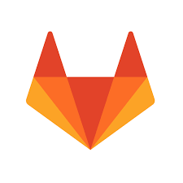
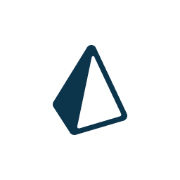
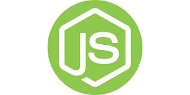

## Heyo! 🔥

### I'm Ilian, yep that's it.

- Currently working on:
    - [PgData Api](https://github.com/Iliannnn/PgData-Api) - An api full of data about Pokemon Go, free and opensource
    - [discord-lib](https://github.com/discord-lib/discord-lib) - A lightweight library for interacting with the Discord API
    - [React-Portfolio](https://github.com/Iliannnn/React-Portfolio) - A portfolio template build with React
    - [Celendi v2](https://celendi.me/) - The v2 rewrite of Celendi
- Projects:
    - [Imagehost-Template-PHP](https://github.com/Iliannnn/Imagehost-Template-PHP) - A imagehost template build with PHP

### Connect with me:

### Languages, Libraries and Frameworks:

### Tools

 
 

---

